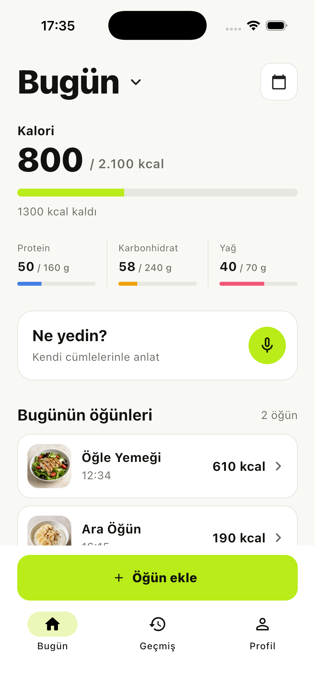

# Meal Clarity

An accuracy-first mobile meal logger built for the EatBetter full-stack case
study.

The first vertical slice is intentionally deterministic while the real backend
contract is developed behind repository boundaries:

- Today dashboard with totals derived from meal items
- Natural-language meal composer
- Mock analysis behind a replaceable `MealRepository` boundary
- Editable structured food review
- Human-in-the-loop portion clarification
- Log success with undo instead of a blocking success screen
- Catalog photography with explicit provenance labels
- Meal detail with deterministic portion editing and delete confirmation
- MVVM presentation state with replaceable data repositories
- Local Supabase foundation for auth, canonical foods, vector retrieval, meal
  persistence, correction feedback, and analysis traces



## Run

```sh
flutter pub get
flutter run
```

## Verify

```sh
flutter analyze
flutter test
flutter test integration_test/meal_logging_test.dart -d <device-id>
```

The integration test has been exercised on an iOS Simulator. It covers the
critical ambiguous-input path from composition through portion clarification
to the daily overview.

## Architecture

- `domain`: immutable nutrition, food, draft, and logged-meal models
- `data`: repository contracts and deterministic demo implementations
- `view_models`: flow, daily overview, and detail state without widget concerns
- `features`: Flutter views, navigation, sheets, and interaction details
- `supabase`: reproducible local config, forward-only migrations, and seed data

Nutrition totals are derived from meal items in both the Flutter domain and the
database. The database snapshots per-100g values on each logged item for audit
history, then generated columns and a trigger calculate item and meal totals.

## Supabase: local now, deploy later

No hosted project is required to develop the schema:

```sh
supabase start
supabase db reset
supabase db lint
```

When the hosted project is ready, apply the same committed migrations without
recreating the schema manually:

```sh
supabase login
supabase link --project-ref <project-ref>
supabase db push
```

Do not commit the service-role key or database password. The mobile app will
only receive the project URL and publishable/anon key; privileged AI writes
belong in an Edge Function or backend service.

The initial schema includes:

- user-owned profiles and meals protected by row-level security
- canonical foods, localized aliases, portions, and `pgvector` embeddings
- idempotency keys for analysis runs and meal logging
- prompt/model/retrieval versions, latency, trace IDs, and ranked candidates
- per-item confidence, match method, review status, and correction feedback
- generated nutrition values and server-controlled meal totals

The migrations and seed have been deployed to the hosted Supabase project.
Remote `db lint` reports no schema errors, and local/remote migration history is
in sync. The first local Docker image pull stalled on this machine, so local
`db reset` remains a separate environment follow-up rather than a schema blocker.

The product and architecture research is in
`CASE_STUDY_RESEARCH_REPORT_TR.md`.

Generated food asset disclosure is in `docs/ASSET_PROVENANCE.md`.
