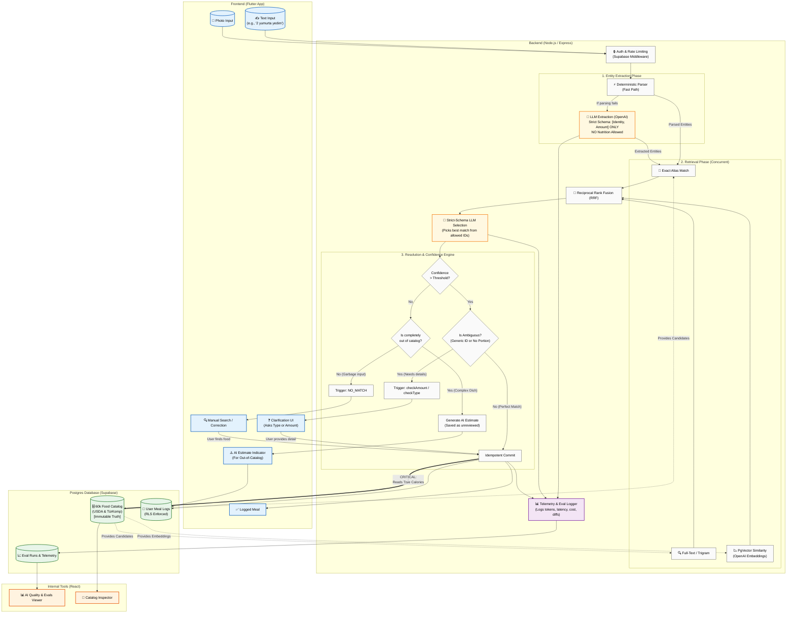

# Meal Clarity - Architecture & AI Accuracy Flow

This document details the end-to-end architecture and the AI accuracy flow for the Meal Clarity application, explicitly showing how hallucinations are prevented and how the "Model interprets, Catalog decides" philosophy is implemented.

## Key Architectural Decisions Highlighted

1. **Schema Restriction (Entity Extraction):** The extraction LLM is physically incapable of returning nutrition data. It can only return `Identity` and `Amount`.
2. **Tri-modal Retrieval:** We don't rely solely on vector search. We use Exact Matches, Trigrams, and Vectors combined via RRF to ensure we find the right catalog rows.
3. **The "Critical Path" (Red Dashed Arrow):** Even if the LLM is confident, the final numbers are **always** read directly from the `Catalog` inside Postgres during the commit. The client/LLM can never forge a calorie count.
4. **Clarification Loop:** Instead of guessing when a generic term (e.g., "Egg") is used, the system halts and asks the user (Clarification UI), fixing the biggest issue with competitor apps (portion inaccuracy).
