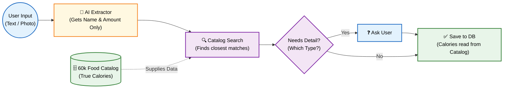

# Meal Clarity - Simplified Architecture Flow

This diagram shows the high-level flow of the meal logging process, emphasizing the core "Model interprets, Catalog decides" philosophy.

```mermaid
flowchart LR
    %% --- Colors ---
    classDef user fill:#E3F2FD,stroke:#1565C0,stroke-width:2px,color:#000
    classDef ai fill:#FFF8E1,stroke:#F57F17,stroke-width:2px,color:#000
    classDef db fill:#E8F5E9,stroke:#2E7D32,stroke-width:2px,color:#000
    classDef resolve fill:#F3E5F5,stroke:#7B1FA2,stroke-width:2px,color:#000

    %% --- Nodes ---
    Input(("User Input\n(Text / Photo)")):::user
    
    AI["🧠 AI Extractor\n(Gets Name & Amount Only)"]:::ai
    
    Search["🔍 Catalog Search\n(Finds closest matches)"]:::resolve
    
    Catalog[("🗄️ 60k Food Catalog\n(True Calories)")]:::db
    
    Clarify{"Needs Detail?\n(Which Type?)"}:::resolve
    
    AskUser["❓ Ask User"]:::user
    
    Save["✅ Save to DB\n(Calories read from Catalog)"]:::db

    %% --- Edges ---
    Input --> AI
    AI --> Search
    Catalog -. "Supplies Data" .-> Search
    Search --> Clarify
    
    Clarify -- "Yes" --> AskUser
    AskUser --> Save
    Clarify -- "No" --> Save
```
