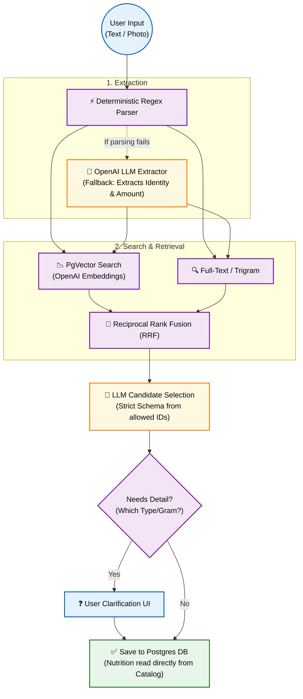

# Meal Clarity - Core Architecture Flow

This diagram illustrates the core technical flow, showing how inputs are processed through deterministic parsers, vector embeddings, and LLM selection, while strictly isolating nutrition facts in the database.

