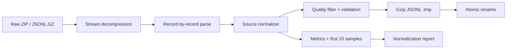

# EatBetter Nutrition Data Pipeline — Teknik Case Study

**Tarih:** 23 Ağustos 2026  
**Proje türü:** Meal logging mobil uygulaması / yerel ve dağıtılmayan case study  
**Çalışmanın kapsamı:** Nutrition dataset keşfi, ortak veri modeli tasarımı, deterministic ingestion/normalization, kalite filtreleme, doğrulama ve raporlama

## 1. Yönetici özeti

Meal logging uygulamasının doğru çalışabilmesi için yalnızca geniş bir gıda listesine sahip olmak yeterli değildir. Farklı kaynaklar aynı kavramları farklı alan adları, nutrient kimlikleri, ölçü birimleri, portion yapıları ve kalite sinyalleriyle yayınlar. Bu çalışmada USDA FoodData Central, TürKomp ve Open Food Facts kaynakları gerçek dosya yapıları incelenerek tek, kaynak-korumalı bir nutrition modeline normalize edildi.

Çalışmanın sonucunda:

- Altı kaynak katmanında toplam **5.169.038 ham array öğesi/JSONL satırı** işlendi.
- Altı ayrı kaynak katmanı için toplam **1.400.586 doğrulanmış normalize kayıt** üretildi.
- Yaklaşık **12 GB sıkıştırılmış Open Food Facts dosyası**, tamamen açılmadan ve RAM'e yüklenmeden streaming olarak işlendi.
- USDA Branded içindeki yaklaşık 3,3 GB uncompressed tek JSON dokümanı ZIP'ten kayıt bazında stream edildi.
- Nutrient derivation, measurement source, `dataPoints`, min/max/median, portion gram dönüşümleri ve kaynak kalite etiketleri kaybedilmedi.
- Kaynaklar birbirleriyle canonical olarak birleştirilmedi; hiçbir kaynak kaydı diğerinin üzerine yazılmadı.
- Supabase import bu aşamada bilinçli olarak yapılmadı.
- Pipeline iki tam koşuda aynı input/output sayılarını üretti; Foundation çıktısında byte-level idempotence aynı SHA-256 hash'iyle ayrıca doğrulandı.

Bu çalışma, uygulamanın gelecekteki food matching, portion resolution ve confidence hesaplama katmanlarının güvenilir bir veri temeline oturmasını sağladı.

## 2. Problem

Üç veri sağlayıcısı aynı problemi farklı şekillerde modelliyor:

- USDA Foundation analitik veriler, derivation türleri ve örneklem istatistikleri bakımından güçlü.
- FNDDS, insanların gerçekten tükettiği yemekleri ve household portion → gram dönüşümlerini içeriyor.
- USDA SR Legacy geniş generic-food kapsamı sağlıyor ancak 2018'de dondurulmuş tarihsel bir kaynak.
- USDA Branded marka, barcode, ingredients ve serving bilgileri sağlıyor fakat kalite üretici etiketlerine bağlı.
- TürKomp Türkiye'ye özgü gıdaları, LanguaL kodlarını ve component bazlı average/min/max değerlerini sunuyor.
- Open Food Facts milyonlarca barkodlu ürün içeriyor fakat crowd-sourced olduğu için alan doluluğu ve veri kalitesi çok değişken.

Bu verileri doğrudan uygulamada kullanmak aşağıdaki sorunlara yol açardı:

1. Aynı nutrient için farklı alan adları ve kimlikler bulunması.
2. Enerjinin kcal veya kJ, sodyumun g veya mg olarak ifade edilebilmesi.
3. Serving ile 100 g değerlerinin birbirine karıştırılma riski.
4. Portion açıklamalarının gram dönüşümünden kopması.
5. Kaynak kalite ve derivation bilgisinin flattening sırasında kaybolması.
6. Milyonlarca OFF ürününün önemli bölümünün meal logging için yetersiz olması.
7. Büyük dosyaların klasik `JSON.parse` veya tam decompression ile işlenememesi.

## 3. Kapsam ve bilinçli olarak yapılmayanlar

Bu fazın hedefi yalnızca **deterministic, tekrar çalıştırılabilir ve kaynak-korumalı normalization pipeline** oluşturmaktı.

Yapılanlar:

- Gerçek archive ve kayıt şemalarının incelenmesi
- Ortak, versioned TypeScript modelinin tasarlanması
- Kaynak bazlı normalizer'ların geliştirilmesi
- Unit ve nutrient-ID eşlemeleri
- Portion/serving normalizasyonu
- Quality filtering ve skip reason ölçümü
- Compressed JSONL output
- Structural validation ve metrik raporu

Bilinçli olarak yapılmayanlar:

- Supabase import
- Kaynaklar arası canonical food merge
- Duplicate ürünlerin kaynaklar arasında birleştirilmesi
- Bir kaynağın diğerinden daha doğru olduğuna karar verip overwrite yapılması
- Eksik nutrient değerlerinin başka kaynaktan doldurulması
- LLM ile field tahmini veya veri imputation
- Uygulamaya ship edilecek katalog alt kümesinin seçilmesi

Bu ayrım önemliydi: normalization ile entity resolution aynı aşamada yapılırsa hangi değerin kaynaktan geldiği ve hangi kararın sonradan üretildiği belirsizleşir.

## 4. İncelenen veri kaynakları

| Kaynak | Release / snapshot | Ham kayıt | Karakteristik |
|---|---|---:|---|
| USDA Foundation | 2026-04-30 | 395 array öğesi; 363 geçerli kayıt | Analitik nutrient verisi, derivation, dataPoints, min/max/median |
| USDA FNDDS / Survey | 2024-10-31, FNDDS 2021–2023 | 5.432 | Household portions, gram weights, WWEIA kategorileri, additional descriptions |
| USDA SR Legacy | 2018-04 | 7.793 | Geniş generic-food kapsamı, tarihsel nutrient verisi |
| USDA Branded | 2026-04-30 | 455.458 | Marka, GTIN/UPC, ingredients, serving, package ve label kaynaklı nutrient verisi |
| TürKomp | Site snapshot 2026-08-22 | 645 gıda / 26.215 component satırı | 100 g yenilebilir kısım, average/min/max, LanguaL ve Türkiye odaklı food metadata |
| Open Food Facts | Daily export, 2026-08-22 | 4.699.315 JSONL satırı | Global barcode kapsamı, serving/language/country/category ve crowd-sourced kalite sinyalleri |

Raw artifact'ların release, indirme zamanı, byte boyutu, SHA-256, lisans ve kaynak URL bilgileri `data/sources.json` içinde tutuluyor.

## 5. Önce şema keşfi, sonra implementasyon

Field adları dokümantasyondan tahmin edilmedi. Önce gerçek ZIP üyeleri, JSON kayıtları, nested object'ler ve OFF JSONL satırları okundu.

### USDA'da doğrulanan yapılar

- `fdcId`, `description`, `dataType`, `foodClass`, `publicationDate`
- Foundation/SR için `foodCategory`, `ndbNumber`, `nutrientConversionFactors`
- FNDDS için `foodCode`, `startDate`, `endDate`, `wweiaFoodCategory`
- `foodNutrients[].nutrient.id/name/number/unitName`
- `foodNutrients[].foodNutrientDerivation`
- Foundation/SR için `dataPoints`, `min`, `max`, `median`
- `foodPortions[].gramWeight`, `portionDescription`, `modifier`, `measureUnit`
- `foodAttributes` içindeki Additional Description, Adjustments ve WWEIA attribute'ları
- Branded için `brandName`, `brandOwner`, `gtinUpc`, `ingredients`, `servingSize`, `servingSizeUnit`, `householdServingFullText`, `packageWeight`, `marketCountry`

### TürKomp'ta doğrulanan yapılar

- `source_food_id`, `turkomp_code`, `name`, `scientific_name`, `regional_name`
- `food_groups`, `langual_codes`
- `nitrogen_factor`, `fat_conversion_factor`
- Her component için `component_id`, `marker`, `name`, `unit`
- `average`, `min`, `max` ve orijinal raw text değerleri
- Açık basis: **100 g edible portion**

### Open Food Facts'te doğrulanan yapılar

- `code`, `product_name`, `generic_name`, language-specific adlar
- `brands`, `quantity`, `serving_size`, `serving_quantity`, `serving_quantity_unit`
- `countries_tags`, `categories_tags`, `languages_codes`
- `ingredients_text`, allergens, traces, labels ve ingredient analysis tags
- `nutriments.*_100g`
- `completeness`, `data_quality_*_tags`, `states_tags`
- Nutri-Score, NOVA ve environmental score alanları
- `scans_n`, `unique_scans_n`, modification timestamp'leri

## 6. Ortak normalize model

Model `schema_version: 1.0.0` ile versionlandı. Kimlik ve temel nutrition alanları kolay sorgulanabilir tutulurken, kaynakların zengin nutrient/provenance bilgisi genel dizilerde korundu.

### Core alanlar

```ts
{
  schema_version,
  name,
  source,
  source_id,
  dataset_version,
  nutrition_basis: { amount: 100, unit: "g", description },
  nutrition: {
    kcal_100g,
    protein_100g,
    carbs_100g,
    fat_100g,
    fiber_100g,
    sugars_100g,
    sodium_mg_100g,
    nutrients: []
  },
  portions: [],
  quality: { nutrition_completeness, confidence_inputs },
  provenance: {}
}
```

### Neden hem düz core alanlar hem `nutrients[]` var?

Core alanlar meal calculation ve arama için hızlı, stabil bir interface sağlar. Yalnızca bu alanları saklamak ise micronutrient'leri ve ölçüm kalitesini kaybettirirdi. Bu nedenle her yayınlanmış nutrient ayrıca şu bilgilerle korunur:

- Kaynağın stabil nutrient ID veya marker'ı
- Kaynak nutrient adı
- 100 g değeri ve birimi
- Derivation kodu ve açıklaması
- Measurement source
- `data_points`
- `min`, `max`, `median`

Bu yapı ileride confidence hesabı yapılırken “değer var mı?” sorusunun ötesine geçip “analitik mi, calculated mı, kaç data point'e dayanıyor?” sorularının cevaplanmasını mümkün kılar.

## 7. Eklenen değerli alanlar

Kullanıcı tarafından istenen temel alanlar whitelist olarak ele alınmadı. Matching, portion resolution, kalite ve gelecekteki özellikler için aşağıdaki alanlar da modele eklendi.

| Alan | Neden faydalı? | Kaynaklar | Statü |
|---|---|---|---|
| `nutrition.nutrients[]` | Micronutrient ve kaynak ölçüm detayını kaybetmez | Tüm kaynaklar | Core container; satır metadatası optional |
| `additional_descriptions` | Synonym ve food matching recall'ını geliştirir | Özellikle FNDDS | Optional |
| `aliases` | Generic veya farklı dilde ürün adlarını korur | OFF | Optional |
| Category code/tags/hierarchy | Category-aware retrieval ve ranking sağlar | USDA, TürKomp, OFF | Optional |
| `classification_codes` | LanguaL üzerinden gelecekte semantik eşleştirmeyi destekler | TürKomp | Optional |
| `food_code` | FNDDS food code, NDB veya TürKomp code ile exact lookup sağlar | USDA, TürKomp | Optional |
| `language`, `languages`, `countries` | Locale ve market-aware ürün sıralaması sağlar | OFF | Optional |
| `market_country` | Branded ürünün pazar bağlamını korur | USDA Branded | Optional |
| `package_size` | Serving/package çözümlemesine yardımcı olur | USDA Branded, OFF | Optional |
| `scientific_name`, `regional_name` | Yerel ve bilimsel isimlerle eşleştirmeyi geliştirir | TürKomp | Optional |
| Source completeness ve quality tags | Confidence için kaynağın kendi kalite sinyallerini korur | OFF | Optional |
| Nutri-Score / NOVA / environmental score | Gelecekte ürün içgörülerini destekler; nutrition değerini değiştirmez | OFF | Optional |
| Allergens, traces, labels | Diyet filtreleri ve güvenlik uyarıları için gereklidir | OFF | Optional |
| Ingredient analysis tags | Vegan/vegetarian/palm-oil gibi gelecek özelliklere temel olur | OFF | Optional |
| Popularity/scans | Eşit adaylar arasında ranking sinyali olabilir | OFF | Optional |
| Nutrient conversion factors | Protein/fat hesaplama bağlamını korur | Foundation, SR, TürKomp | Optional |
| Publication/modified/validity dates | Freshness ve version-aware seçim sağlar | USDA, OFF | Optional |

## 8. Nutrient normalizasyon kararları

### USDA nutrient ID eşlemesi

Temel nutrient'ler isim karşılaştırmasıyla değil, gerçek USDA nutrient ID'leriyle eşlendi:

| Normalize alan | USDA nutrient ID |
|---|---|
| Protein | `1003` |
| Fat | `1004` |
| Carbohydrate by difference | `1005` |
| Energy | `1008`, fallback `2048`, sonra `2047` |
| Fiber | `1079` |
| Total sugars | `2000`; Foundation varyantı `1063` |
| Sodium | `1093` |

Enerji için öncelik açıkça kodlandı. Böylece bir kayıtta birden fazla kcal yöntemi varsa sonuç JSON array sırasına bağlı kalmıyor.

### Serving ile 100 g ayrımı

USDA Branded içindeki `foodNutrients` değerleri USDA tarafından 100 g basis'e normalize edilmiş alanlardır. `labelNutrients` ise serving-basis olabilir. Serving değerlerini yanlışlıkla 100 g alanlarına taşımamak için core nutrition `foodNutrients` üzerinden üretildi; serving bilgisi ayrı portion/serving alanlarında korundu.

### Open Food Facts sodyum dönüşümü

OFF export'undaki `sodium_100g` standardize değer gram basis'indedir. Kaydın display-unit alanı `mg` gösterebilse de `_100g` sayısı gram değeridir. Bu nedenle:

```text
sodium_mg_100g = sodium_100g × 1000
```

### TürKomp şeker türetimi

TürKomp snapshot'ında ayrı bir total sugars component'i bulunmadığında mevcut mono/disakkarit component'leri deterministic olarak toplandı. Sonuç published total gibi gösterilmedi; nutrient detayında `SUM_COMPONENTS` derivation koduyla açıkça işaretlendi.

## 9. Portion ve serving modellemesi

Meal logging doğruluğu yalnız nutrient değerine değil, kullanıcı ifadesini grama çevirebilmeye bağlıdır.

### FNDDS

FNDDS portion kayıtları flatten edilmedi. Her dönüşüm ayrı olarak korundu:

```json
{
  "amount": 1,
  "unit": "undetermined",
  "description": "1 cup, cooked, diced",
  "gram_weight": 165,
  "source_portion_id": "292710",
  "source_modifier": "10049",
  "sequence": 1
}
```

Bu sayede “1 cup”, “1 slice”, “1 piece” veya “1 oz cooked” gibi farklı kullanıcı ifadeleri aynı gıda için doğru gram ağırlığına bağlanabilir.

### Foundation ve SR Legacy

`amount/value`, `measureUnit`, `modifier`, `gramWeight`, `minYearAcquired` ve sequence bilgisi korundu. Sıfır veya negatif gram dönüşümleri geçersiz sayıldı.

### Branded ve OFF

Serving size, unit ve household description ayrı tutuldu. Serving birimi gram ise portion gram weight üretildi; mL gibi yoğunluk gerektiren birimler tahminle grama çevrilmedi.

## 10. Streaming mimarisi



### Open Food Facts

OFF dosyası yaklaşık 12 GB compressed olduğu için hiçbir aşamada tamamen decompress edilmedi:

```text
createReadStream
  → createGunzip
  → readline
  → JSON.parse(current line)
  → quality filter
  → normalize
  → createGzip
  → JSONL output
```

Bellek kullanımı dataset boyutuna göre büyümez; yalnız mevcut satır/kayıt, stream buffer'ları, metrik sayaçları ve rapor için ilk 10 örnek tutulur.

### USDA Branded

Branded ZIP yaklaşık 195 MB olsa da içindeki tek JSON dokümanı yaklaşık 3,3 GB'tır. Tüm dokümana `JSON.parse` uygulanmadı. ZIP member `unzip -p` ile stream edildi; top-level array içindeki object sınırları string/escape ve brace depth takip edilerek ayrıldı. Böylece nested JSON object'ler bozulmadan tek kayıt halinde normalizer'a iletildi.

### Atomik output

Her çıktı önce `<filename>.tmp` olarak yazılır. Gzip stream başarılı kapanırsa final dosya atomik rename ile değiştirilir. Hata veya yarım çalışma, geçerli final dosyanın yerine yarım gzip bırakmaz.

## 11. Open Food Facts kalite filtresi

Crowd-sourced dump içindeki her barcode meal logging için kullanılabilir değildir. Filtreler açık ve değiştirilebilir tutuldu.

Varsayılan config:

```json
{
  "minCoreNutrients": 3,
  "requireEnergy": true,
  "requireBarcode": true,
  "maxKcal": 1000
}
```

Ortam değişkenleri:

- `OFF_MIN_CORE_NUTRIENTS`
- `OFF_REQUIRE_ENERGY`
- `OFF_REQUIRE_BARCODE`
- `OFF_MAX_KCAL`

Bir ürünün kabul edilmesi için varsayılan olarak:

1. Kullanılabilir ürün adı bulunmalı.
2. 4–14 haneli numeric barcode bulunmalı.
3. `nutriments` object'i bulunmalı.
4. Enerji bulunmalı.
5. Yedi core nutrient'ten en az üçü bulunmalı.
6. Core değerler fiziksel olarak makul aralıklarda olmalı.

Filtrelenen ürünler sessizce atılmadı; her neden ayrı sayıldı.

| OFF skip nedeni | Kayıt |
|---|---:|
| Missing energy | 2.727.591 |
| Missing nutriments object | 625.550 |
| Missing product name | 324.502 |
| Invalid veya missing barcode | 69.192 |
| Implausible core nutrition | 16.163 |
| Insufficient core nutrition | 5.422 |
| **Toplam skipped** | **3.768.420** |

Bu filtre sonucu 4.699.315 satırdan **930.895 meal-logging adayı** üretildi.

## 12. Kalite ve provenance yaklaşımı

Bu fazda kaynaklar arasında yapay tek bir confidence score oluşturulmadı. Bunun yerine gelecekteki confidence modelinin kullanabileceği gözlemlenebilir input'lar korundu:

- Nutrition completeness
- Gram portion varlığı
- Barcode varlığı
- Nutrient derivation
- Data point sayısı
- Published min/max/median
- OFF source completeness
- OFF warning/error/bug/quality tags
- Publication veya modification tarihi
- Kaynağın analitik, calculated, label-derived veya crowd-sourced olması

Bu yaklaşım, confidence'ın geriye dönük açıklanabilir olmasını sağlar. Örneğin “bu eşleşme düşük güvenli” demek yerine hangi sinyallerin eksik olduğu gösterilebilir.

## 13. Validation sırasında yakalanan gerçek edge-case'ler

Pipeline yalnız happy-path üzerinde test edilmedi. Tam dataset validation aşağıdaki sorunları ortaya çıkardı ve normalizer davranışı düzeltildi.

### 13.1 Foundation array içindeki literal null kayıtlar

Foundation archive top-level array'inde 363 gıda kaydına ek olarak 32 literal `null` bulunuyordu. Bunlar parse hatası sayılmadı; `null_or_non_object` skip reason olarak ölçüldü.

### 13.2 Negatif analytical carbohydrate değerleri

Foundation'daki bazı yeni et ürünlerinde `Carbohydrate, by difference` küçük negatif analytical sonuçlar içeriyordu. Bu source nutrient satırları provenance amacıyla korundu, ancak negatif değer meal-logging core `carbs_100g` alanına promote edilmedi.

### 13.3 Sıfır gram portion'lar

FNDDS, Branded ve OFF içinde sıfır gram veya sıfır serving quantity edge-case'leri görüldü. Sıfır/non-positive gram dönüşümleri geçersiz sayıldı; açıklama anlamlıysa gramı bilinmeyen serving olarak korunabildi.

### 13.4 Boş core dizilerin serializasyonda düşmesi

Optional empty array'leri temizleyen compact serializer ilk versiyonda `portions: []` gibi core alanları da kaldırabiliyordu. Validator bunu yakaladı. Serializer yalnız optional boş dizileri kaldıracak, `portions` ve `nutrition.nutrients` dizilerini her kayıtta tutacak şekilde düzeltildi.

### 13.5 USDA'da birden fazla energy nutrient'i

Foundation kayıtları `1008`, `2047` ve `2048` energy nutrient'lerinden birden fazlasını içerebilir. Array'de ilk gelen değeri seçmek deterministic görünse de semantik olarak zayıftı. Açık öncelik `1008 → 2048 → 2047` olarak kodlandı.

## 14. Ölçülebilir sonuçlar

| Kaynak | Input | Output | Skipped | Nutrition completeness | Portion coverage | Barcode coverage |
|---|---:|---:|---:|---:|---:|---:|
| USDA Foundation | 395 | 363 | 32 | 77,84% | 78,51% | 0% |
| USDA FNDDS | 5.432 | 5.432 | 0 | 99,98% | 100% | 0% |
| USDA SR Legacy | 7.793 | 7.793 | 0 | 95,54% | 96,66% | 0% |
| USDA Branded | 455.458 | 455.458 | 0 | 95,98% | 100% | 100% |
| TürKomp | 645 | 645 | 0 | 89,57% | 0% | 0% |
| Open Food Facts | 4.699.315 | 930.895 | 3.768.420 | 90,94% | 68,95% | 100% |

Toplam normalize ve validation'dan geçen kayıt: **1.400.586**.

Coverage metriklerinin anlamı:

- **Nutrition completeness:** Yedi core nutrient alanının kayıt başına ortalama doluluk oranı.
- **Portion coverage:** En az bir kullanılabilir portion kaydı bulunan normalize gıdaların oranı.
- **Barcode coverage:** Barcode bulunan normalize kayıtların oranı.

TürKomp portion coverage'ının %0 olması veri kaybı değildir; kaynak snapshot nutrition composition sunuyor fakat household serving/gram dönüşümü yayınlamıyor.

## 15. Doğrulama ve idempotence

Validator bütün gzip JSONL dosyalarını satır satır okuyarak şu kontrolleri yaptı:

- Geçerli JSON
- `schema_version` uyumu
- Zorunlu identity alanları
- 100 g nutrition basis
- Core collection'ların varlığı
- Numeric ve non-negative promoted nutrition değerleri
- Pozitif gram portion dönüşümleri
- Output satır sayısı ile metrics sayısının eşleşmesi
- Gzip bütünlüğü

Sonuç:

```text
Validated 1400586 records across 6 sources.
```

Pipeline iki kez tam çalıştırıldı ve kaynak bazlı input/output sayıları aynı kaldı. Foundation normalizer ayrıca arka arkaya yeniden çalıştırıldı; gzip output'un SHA-256 değeri değişmedi:

```text
b1be3288affb147cf9b088c1c91614f03239cc4092adb145c71854e1a944e90d
```

Determinism için:

- Kaynak sırası korunur.
- Rastgele ID veya timestamp üretilmez.
- Core nutrient seçim öncelikleri açıktır.
- Skip kriterleri config olarak tanımlıdır.
- Output başarıyla tamamlanmadan final dosya değiştirilmez.

## 16. Üretilen teknik yapı

```text
tool/food_import/
├── normalization-schema.ts
├── src/
│   ├── normalization-common.ts
│   ├── usda-normalizer.ts
│   ├── turkomp-normalizer.ts
│   └── openfoodfacts-normalizer.ts
└── bin/
    ├── normalize.ts
    ├── validate-normalized.ts
    └── generate-report.ts

data/normalized/
├── usda-foundation.jsonl.gz
├── usda-fndds.jsonl.gz
├── usda-sr-legacy.jsonl.gz
├── usda-branded.jsonl.gz
├── turkomp.jsonl.gz
├── openfoodfacts.jsonl.gz
├── normalization-metrics.json
└── validation-report.json

docs/reports/normalization-report.md
```

Pipeline komutları:

```bash
node tool/food_import/bin/normalize.ts
node tool/food_import/bin/validate-normalized.ts
node tool/food_import/bin/generate-report.ts
```

Tek kaynak geliştirme koşusu:

```bash
node tool/food_import/bin/normalize.ts --source usda-fndds
node tool/food_import/bin/normalize.ts --source openfoodfacts --limit 10000
```

`--limit` yalnız smoke test içindir; production metrics için tam koşu yapılır.

## 17. Mimari kazanımlar

Bu faz sonunda uygulama tarafında aşağıdaki yetenekler için güvenilir temel oluştu:

### Food matching

- Source ID ve food code ile exact lookup
- Additional descriptions ve aliases ile synonym matching
- Category, country ve language-aware ranking
- Barcode exact match
- LanguaL üzerinden gelecekte classification-aware retrieval

### Portion resolution

- FNDDS household description → gram dönüşümleri
- Foundation/SR measure-unit portions
- Branded/OFF serving text ve gram serving
- Package size bilgisinin gelecekte serving inference'ta kullanılması

### Nutrition calculation

- Bütün kaynaklarda ortak 100 g basis
- Stabil core macro interface
- Serving değerleriyle 100 g değerlerinin ayrılması
- Sodium'un tek bir mg/100 g birimine normalize edilmesi

### Confidence ve provenance

- Derivation/measurement türü
- Data point ve dağılım istatistikleri
- Kaynak kalite etiketleri
- Publication/version bilgisi
- Her kaydın source + source_id ile geriye izlenebilmesi

## 18. Sınırlamalar

Bu pipeline production-ready canonical katalog değildir. Bilinçli olarak kalan işler:

1. Kaynaklar arası duplicate/canonical entity resolution yapılmadı.
2. Aynı ürünün farklı barcode veya ülke varyantları birleştirilmedi.
3. OFF filtreleri uygulama hedef pazarına göre henüz country/language önceliği kullanmıyor.
4. TürKomp'ta household portion bulunmadığı için ayrı bir portion kaynağıyla zenginleştirme gerekir.
5. Density gerektiren mL → gram dönüşümleri tahmin edilmedi.
6. Nutrition plausibility kuralları temel fiziksel limitlerle sınırlı; category-specific anomaly detection yapılmadı.
7. Confidence score henüz hesaplanmıyor; yalnız açıklanabilir input sinyalleri hazırlandı.
8. Lisans koşulları nedeniyle OFF ve TürKomp türetilmiş verilerinin dağıtıma açılmasından önce yeniden lisans değerlendirmesi gerekir.

## 19. Sonraki teknik adımlar

Önerilen sıra:

1. Normalize kayıtlar üzerinde source içi duplicate analizi
2. Canonical food model ve source-link tablosu tasarımı
3. Türkiye odaklı Tier-A katalog seçimi
4. Alias/token/category/barcode search index'leri
5. Portion resolver ve density politikası
6. Confidence modelinin açıklanabilir sinyallerle kalibre edilmesi
7. Golden food-matching ve portion eval setleri
8. Ancak bundan sonra Supabase import ve uygulama entegrasyonu

## 20. Case study açısından gösterilen yetkinlikler

Bu çalışma yalnızca “dataset import ettim” çalışması değildir. Aşağıdaki mühendislik kararlarını ve yetkinlikleri gösterir:

- Heterojen ve nested veri şemalarını keşfetme
- Büyük veri dosyalarında bounded-memory streaming
- Domain odaklı ortak veri modeli tasarlama
- Veri kaybını önleyen provenance yaklaşımı
- Unit ve basis semantiğine dikkat eden nutrition normalization
- Configurable data-quality filtering
- Idempotent ve atomik batch pipeline geliştirme
- Tam dataset üzerinde ölçülebilir validation
- Edge-case'leri validator ile bulup pipeline sözleşmesini iyileştirme
- Lisans ve redistribution sınırlarını teknik tasarımın parçası olarak ele alma

Sonuç olarak meal logging uygulamasının AI veya retrieval katmanı artık besin değerini tahmin etmek zorunda değildir. Bu katmanların görevi doğru kaydı ve doğru porsiyonu bulmak; nutrition hesabının görevi ise bu doğrulanabilir, versioned katalog üzerinden deterministic olarak yapılmaktır.

## 21. İlgili dosyalar

- Ortak schema: `tool/food_import/normalization-schema.ts`
- Pipeline: `tool/food_import/bin/normalize.ts`
- USDA normalizer: `tool/food_import/src/usda-normalizer.ts`
- TürKomp normalizer: `tool/food_import/src/turkomp-normalizer.ts`
- OFF normalizer: `tool/food_import/src/openfoodfacts-normalizer.ts`
- Validator: `tool/food_import/bin/validate-normalized.ts`
- Ayrıntılı otomatik rapor: `docs/reports/normalization-report.md`
- Metrikler: `data/normalized/normalization-metrics.json`
- Validation sonucu: `data/normalized/validation-report.json`
- Raw artifact provenance: `data/sources.json`
